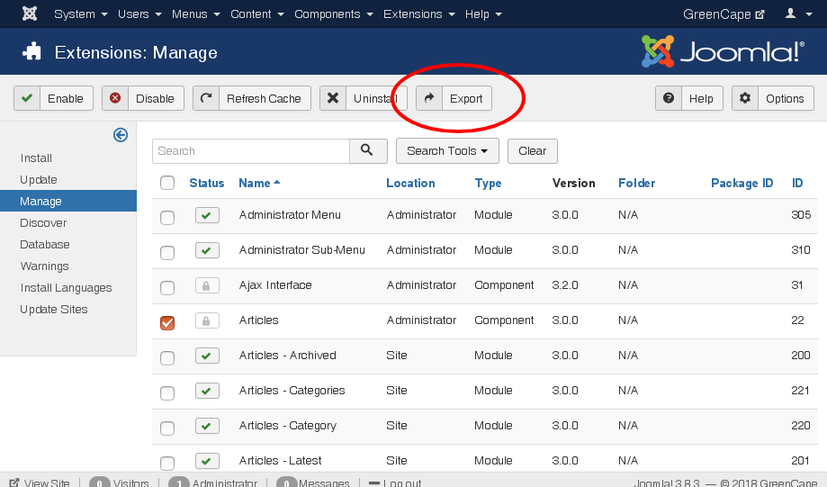
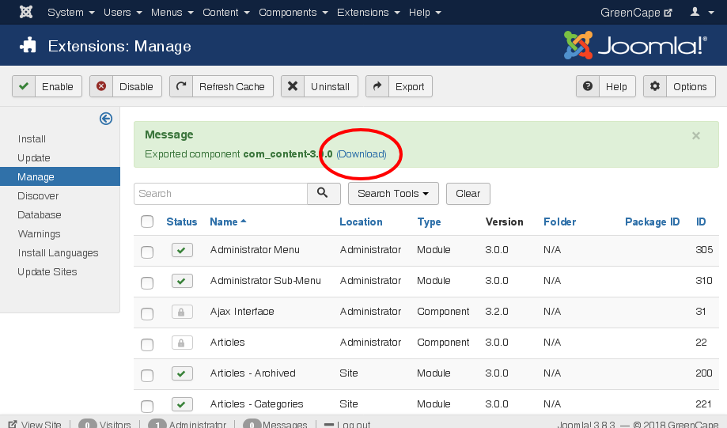

# GreenCape Extension Export

This is a **system plugin** for Joomla that extends Joomla's Extension Manager with extension export functionality.

## Installation

Download the latest release (see [Release tab]()) and install it like any other plugin.
Navigate to *Extensions/Plugins*, and search for `extension export`.
Enable the plugin.

## Configuration

When you click on the plugin's name in the view mentioned before, you can edit the settings.

### Directory

Specify the directory, where the exported packages will be stored for later use.
It defaults to `images/dist`, so the packages can easily be managed (renamed, deleted) using the Media Manager.

### File Mode

The File Mode is the UNIX permissions, defaulting to `0664`.

## Usage

Navigate to *Extensions/Manage/Manage*.
In the toolbar, a new button has appeared.

Select the extension that you want to export.
Currently, components, modules, plugins and templates are supported.
Click on the *Export* button.
If everything goes right, you'll see a success message with a download link.

